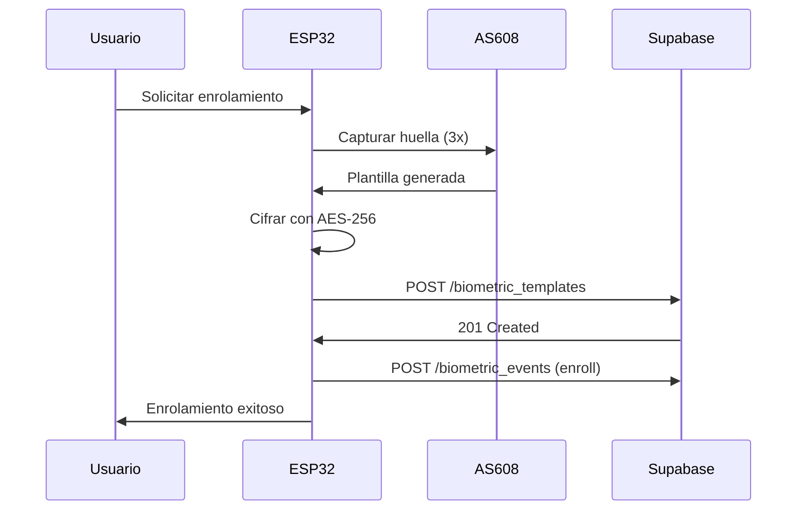
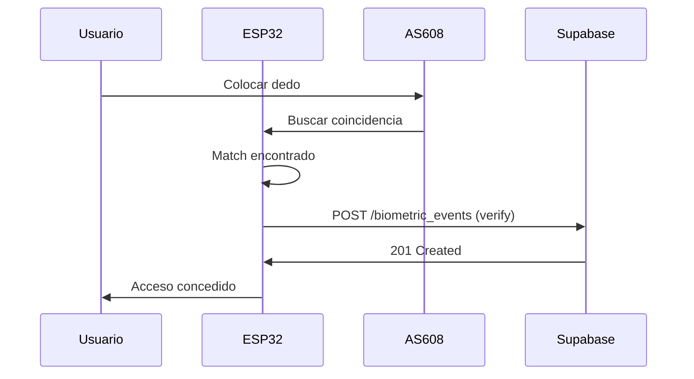

# Integración Sistema Biométrico AS608 con ESP32

## Descripción General

Este documento describe la integración del lector de huellas dactilares AS608 con un microcontrolador ESP32 para el sistema de control de acceso y asistencia.

## Arquitectura

```
┌─────────────┐      UART      ┌──────────┐      HTTP/WiFi      ┌──────────────┐
│   AS608     │ ◄────────────► │  ESP32   │ ◄─────────────────► │  Supabase    │
│ Fingerprint │                 │          │                      │  (Postgres)  │
│   Sensor    │                 │          │                      │              │
└─────────────┘                 └──────────┘                      └──────────────┘
```

## Componentes de Hardware

### AS608 Fingerprint Sensor
- **Modelo**: AS608 (Sensor óptico de huellas dactilares)
- **Interfaz**: UART (TX, RX)
- **Voltaje**: 3.3V DC
- **Capacidad**: 200 plantillas
- **Tiempo de identificación**: < 0.5s
- **FAR (False Accept Rate)**: < 0.001%
- **FRR (False Reject Rate)**: < 1%

### ESP32 (Recomendado: ESP32-WROOM-32)
- **WiFi**: 802.11 b/g/n
- **UART**: Para comunicación con AS608
- **GPIO**: Para indicadores LED opcionales

## Conexión Hardware

```
AS608          ESP32
─────          ─────
VCC    ──────► 3.3V
GND    ──────► GND
TX     ──────► RX (GPIO16 recomendado)
RX     ──────► TX (GPIO17 recomendado)
```

## Base de Datos

### Tablas Relevantes

#### `biometric_templates`
Almacena las plantillas biométricas cifradas.

```sql
CREATE TABLE public.biometric_templates (
  id UUID PRIMARY KEY,
  user_id UUID NOT NULL REFERENCES auth.users(id),
  encrypted_template TEXT NOT NULL,  -- Plantilla AS608 cifrada con AES-256
  device_id TEXT NOT NULL,           -- ID único del ESP32
  method TEXT DEFAULT 'fingerprint',
  status TEXT DEFAULT 'active',      -- 'active' | 'revoked'
  created_at TIMESTAMP,
  updated_at TIMESTAMP
);
```

#### `biometric_events`
Registra todos los eventos biométricos para auditoría.

```sql
CREATE TABLE public.biometric_events (
  id UUID PRIMARY KEY,
  user_id UUID REFERENCES auth.users(id),
  event_type TEXT NOT NULL,  -- 'enroll' | 'verify' | 'fail' | 'access_denied'
  device_id TEXT NOT NULL,
  hash TEXT,                 -- Hash SHA-256 del evento
  metadata JSONB,            -- {confidence: 95, attempts: 1, match_score: 200}
  created_at TIMESTAMP
);
```

## API Endpoints

### Base URL
```
https://xvnncnddfnwdonqxaqrs.supabase.co
```

### Autenticación
El ESP32 debe usar la **Service Role Key** para realizar operaciones:
```
Authorization: Bearer [SERVICE_ROLE_KEY]
```

⚠️ **SEGURIDAD CRÍTICA**: 
- La Service Role Key debe estar almacenada de forma segura en el ESP32 (usar EEPROM o NVS)
- Nunca exponer esta clave en el código fuente público
- El ESP32 solo puede INSERT en las tablas, no puede leer plantillas

### 1. Enrolar Nueva Huella

**Endpoint**: `POST /rest/v1/biometric_templates`

**Headers**:
```http
Authorization: Bearer [SERVICE_ROLE_KEY]
apikey: [SUPABASE_ANON_KEY]
Content-Type: application/json
Prefer: return=representation
```

**Payload**:
```json
{
  "user_id": "uuid-del-usuario",
  "encrypted_template": "base64_encrypted_template_data",
  "device_id": "ESP32-001",
  "method": "fingerprint",
  "status": "active"
}
```

**Proceso de Enrolamiento**:
1. Usuario coloca el dedo 3 veces en el sensor AS608
2. AS608 genera la plantilla (template)
3. ESP32 cifra la plantilla con AES-256-CBC
4. ESP32 envía plantilla cifrada a Supabase
5. Se registra evento de tipo `enroll`

**Respuesta Exitosa** (201):
```json
{
  "id": "uuid-plantilla",
  "user_id": "uuid-del-usuario",
  "device_id": "ESP32-001",
  "status": "active",
  "created_at": "2025-01-15T10:30:00Z"
}
```

### 2. Registrar Evento de Verificación

**Endpoint**: `POST /rest/v1/biometric_events`

**Headers**:
```http
Authorization: Bearer [SERVICE_ROLE_KEY]
apikey: [SUPABASE_ANON_KEY]
Content-Type: application/json
```

**Payload para Verificación Exitosa**:
```json
{
  "user_id": "uuid-del-usuario",
  "event_type": "verify",
  "device_id": "ESP32-001",
  "hash": "sha256_hash_of_event",
  "metadata": {
    "confidence": 95,
    "match_score": 200,
    "user_name": "Juan Pérez",
    "timestamp": "2025-01-15T10:30:00Z"
  }
}
```

**Payload para Fallo de Verificación**:
```json
{
  "user_id": null,
  "event_type": "fail",
  "device_id": "ESP32-001",
  "hash": "sha256_hash_of_event",
  "metadata": {
    "attempts": 3,
    "reason": "fingerprint_not_found"
  }
}
```

**Respuesta Exitosa** (201):
```json
{
  "id": "uuid-evento",
  "event_type": "verify",
  "created_at": "2025-01-15T10:30:00Z"
}
```

## Implementación en ESP32

### Librerías Requeridas

```cpp
#include <WiFi.h>
#include <HTTPClient.h>
#include <Adafruit_Fingerprint.h>
#include <ArduinoJson.h>
#include <mbedtls/aes.h>
```

### Configuración Inicial

```cpp
// Credenciales WiFi
const char* ssid = "YOUR_WIFI_SSID";
const char* password = "YOUR_WIFI_PASSWORD";

// Configuración Supabase
const char* supabase_url = "https://xvnncnddfnwdonqxaqrs.supabase.co";
const char* service_role_key = "YOUR_SERVICE_ROLE_KEY"; // ⚠️ Mantener seguro
const char* anon_key = "eyJhbGciOiJIUzI1NiIsInR5cCI6IkpXVCJ9...";

// Device ID único
const char* device_id = "ESP32-001";

// Configuración AS608
HardwareSerial mySerial(1);
Adafruit_Fingerprint finger = Adafruit_Fingerprint(&mySerial);

// Clave AES-256 (32 bytes)
const unsigned char aes_key[32] = { /* Your 32-byte key */ };
```

### Función de Cifrado AES-256

```cpp
String encryptTemplate(uint8_t* template_data, size_t length) {
  mbedtls_aes_context aes;
  mbedtls_aes_init(&aes);
  mbedtls_aes_setkey_enc(&aes, aes_key, 256);
  
  size_t padded_length = ((length + 15) / 16) * 16;
  uint8_t* padded_data = (uint8_t*)malloc(padded_length);
  memcpy(padded_data, template_data, length);
  
  // PKCS7 padding
  uint8_t padding_value = padded_length - length;
  for (size_t i = length; i < padded_length; i++) {
    padded_data[i] = padding_value;
  }
  
  uint8_t* encrypted = (uint8_t*)malloc(padded_length);
  uint8_t iv[16] = {0}; // IV inicial (usar random en producción)
  
  mbedtls_aes_crypt_cbc(&aes, MBEDTLS_AES_ENCRYPT, padded_length,
                        iv, padded_data, encrypted);
  
  // Convertir a Base64
  String base64_encrypted = base64::encode(encrypted, padded_length);
  
  free(padded_data);
  free(encrypted);
  mbedtls_aes_free(&aes);
  
  return base64_encrypted;
}
```

### Función de Enrolamiento

```cpp
bool enrollFingerprint(String user_id) {
  Serial.println("Iniciando enrolamiento...");
  
  // Paso 1: Capturar primera imagen
  Serial.println("Coloque el dedo en el sensor...");
  int p = -1;
  while (p != FINGERPRINT_OK) {
    p = finger.getImage();
    if (p == FINGERPRINT_NOFINGER) delay(50);
  }
  
  p = finger.image2Tz(1);
  if (p != FINGERPRINT_OK) return false;
  
  Serial.println("Retire el dedo...");
  delay(2000);
  
  // Paso 2: Capturar segunda imagen
  Serial.println("Coloque el mismo dedo nuevamente...");
  p = -1;
  while (p != FINGERPRINT_OK) {
    p = finger.getImage();
  }
  
  p = finger.image2Tz(2);
  if (p != FINGERPRINT_OK) return false;
  
  // Paso 3: Crear modelo
  p = finger.createModel();
  if (p != FINGERPRINT_OK) return false;
  
  // Paso 4: Obtener plantilla
  uint8_t template_buffer[512];
  p = finger.getModel();
  if (p != FINGERPRINT_OK) return false;
  
  // Obtener la plantilla del buffer del sensor
  p = finger.downloadModel(template_buffer);
  if (p != FINGERPRINT_OK) return false;
  
  // Paso 5: Cifrar plantilla
  String encrypted_template = encryptTemplate(template_buffer, 512);
  
  // Paso 6: Enviar a Supabase
  return sendTemplateToSupabase(user_id, encrypted_template);
}

bool sendTemplateToSupabase(String user_id, String encrypted_template) {
  if (WiFi.status() != WL_CONNECTED) return false;
  
  HTTPClient http;
  String endpoint = String(supabase_url) + "/rest/v1/biometric_templates";
  
  http.begin(endpoint);
  http.addHeader("Authorization", "Bearer " + String(service_role_key));
  http.addHeader("apikey", String(anon_key));
  http.addHeader("Content-Type", "application/json");
  http.addHeader("Prefer", "return=representation");
  
  StaticJsonDocument<1024> doc;
  doc["user_id"] = user_id;
  doc["encrypted_template"] = encrypted_template;
  doc["device_id"] = device_id;
  doc["method"] = "fingerprint";
  doc["status"] = "active";
  
  String json_payload;
  serializeJson(doc, json_payload);
  
  int httpResponseCode = http.POST(json_payload);
  
  bool success = (httpResponseCode == 201);
  
  if (success) {
    Serial.println("✓ Plantilla enviada exitosamente");
    // Registrar evento de enrolamiento
    logEvent(user_id, "enroll", "{\"success\":true}");
  } else {
    Serial.printf("✗ Error HTTP: %d\n", httpResponseCode);
  }
  
  http.end();
  return success;
}
```

### Función de Verificación

```cpp
String verifyFingerprint() {
  Serial.println("Esperando huella para verificación...");
  
  // Capturar imagen
  int p = finger.getImage();
  if (p != FINGERPRINT_OK) return "";
  
  // Convertir imagen a características
  p = finger.image2Tz();
  if (p != FINGERPRINT_OK) return "";
  
  // Buscar coincidencia
  p = finger.fingerFastSearch();
  if (p != FINGERPRINT_OK) {
    logEvent("", "fail", "{\"reason\":\"no_match\"}");
    return "";
  }
  
  // Obtener ID y confidence
  int id = finger.fingerID;
  int confidence = finger.confidence;
  
  // Mapear ID local a user_id de la base de datos
  String user_id = getUserIdFromLocalId(id);
  
  // Registrar evento exitoso
  StaticJsonDocument<256> metadata;
  metadata["confidence"] = confidence;
  metadata["match_score"] = finger.confidence;
  metadata["local_id"] = id;
  
  String metadata_str;
  serializeJson(metadata, metadata_str);
  
  logEvent(user_id, "verify", metadata_str);
  
  Serial.printf("✓ Usuario verificado: %s (Confianza: %d)\n", 
                user_id.c_str(), confidence);
  
  return user_id;
}

void logEvent(String user_id, String event_type, String metadata_json) {
  HTTPClient http;
  String endpoint = String(supabase_url) + "/rest/v1/biometric_events";
  
  http.begin(endpoint);
  http.addHeader("Authorization", "Bearer " + String(service_role_key));
  http.addHeader("apikey", String(anon_key));
  http.addHeader("Content-Type", "application/json");
  
  StaticJsonDocument<512> doc;
  if (user_id.length() > 0) {
    doc["user_id"] = user_id;
  }
  doc["event_type"] = event_type;
  doc["device_id"] = device_id;
  doc["hash"] = generateEventHash(user_id, event_type);
  doc["metadata"] = serialized(metadata_json);
  
  String json_payload;
  serializeJson(doc, json_payload);
  
  http.POST(json_payload);
  http.end();
}
```

### Setup y Loop Principal

```cpp
void setup() {
  Serial.begin(115200);
  mySerial.begin(57600, SERIAL_8N1, 16, 17); // RX=16, TX=17
  
  // Conectar WiFi
  WiFi.begin(ssid, password);
  while (WiFi.status() != WL_CONNECTED) {
    delay(500);
    Serial.print(".");
  }
  Serial.println("\n✓ WiFi conectado");
  
  // Inicializar sensor AS608
  if (finger.verifyPassword()) {
    Serial.println("✓ Sensor AS608 conectado");
  } else {
    Serial.println("✗ Error: Sensor AS608 no encontrado");
    while (1) delay(1);
  }
  
  Serial.printf("Capacidad del sensor: %d\n", finger.templateCount);
}

void loop() {
  // Modo verificación continua
  String user_id = verifyFingerprint();
  
  if (user_id.length() > 0) {
    // Usuario verificado - activar acceso
    Serial.println("✓ ACCESO CONCEDIDO");
    // Aquí activar relé, abrir puerta, etc.
  }
  
  delay(500);
}
```

## Flujo de Comunicación

### Enrolamiento


### Verificación


## Seguridad

### Cifrado de Plantillas
- **Algoritmo**: AES-256-CBC
- **Clave**: 32 bytes generada aleatoriamente
- **IV**: Debe ser aleatorio por cada cifrado (no usar IV=0 en producción)
- **Padding**: PKCS#7

### Almacenamiento Seguro
```cpp
// Almacenar clave AES en NVS (Non-Volatile Storage)
#include <Preferences.h>

Preferences preferences;

void saveAESKey(const uint8_t* key) {
  preferences.begin("biometric", false);
  preferences.putBytes("aes_key", key, 32);
  preferences.end();
}

void loadAESKey(uint8_t* key) {
  preferences.begin("biometric", true);
  preferences.getBytes("aes_key", key, 32);
  preferences.end();
}
```

### Validaciones
1. ✓ Service Role Key nunca se expone al frontend
2. ✓ Plantillas siempre cifradas antes de transmisión
3. ✓ ESP32 solo puede INSERT, no SELECT plantillas
4. ✓ Todos los eventos se registran para auditoría
5. ✓ Hash SHA-256 de cada evento para integridad

## Testing y Depuración

### Test de Conectividad
```cpp
void testSupabaseConnection() {
  HTTPClient http;
  http.begin(String(supabase_url) + "/rest/v1/");
  http.addHeader("apikey", String(anon_key));
  
  int code = http.GET();
  Serial.printf("Supabase ping: %d\n", code);
  http.end();
}
```

### Logs de Depuración
```cpp
#define DEBUG 1

#if DEBUG
  #define DEBUG_PRINT(x) Serial.print(x)
  #define DEBUG_PRINTLN(x) Serial.println(x)
#else
  #define DEBUG_PRINT(x)
  #define DEBUG_PRINTLN(x)
#endif
```

## Configuración Recomendada AS608

```cpp
// Parámetros óptimos para AS608
finger.LEDcontrol(FINGERPRINT_LED_ON, 0, FINGERPRINT_LED_BLUE);
finger.setSecurityLevel(3); // Nivel alto de seguridad
finger.getParameters();
```

## Mantenimiento y Monitoreo

### Indicadores LED
- **Azul parpadeante**: Esperando huella
- **Verde fijo**: Verificación exitosa
- **Rojo fijo**: Error o fallo de verificación

### Logs del Sistema
Todos los eventos se registran en `biometric_events` con:
- Timestamp preciso
- Device ID
- Tipo de evento
- Metadata con detalles técnicos

## Troubleshooting

### Problemas Comunes

**Error: "Sensor not found"**
- Verificar conexiones TX/RX
- Comprobar voltaje (3.3V)
- Revisar baudrate (57600)

**Error: "Template not matching"**
- Limpiar sensor AS608
- Re-enrolar con mejor calidad
- Ajustar security level

**Error: HTTP 403 Forbidden**
- Verificar Service Role Key
- Comprobar políticas RLS
- Revisar permisos de tablas

## Próximos Pasos

1. Implementar comunicación WebSocket para notificaciones en tiempo real
2. Añadir sincronización de plantillas locales con la nube
3. Implementar modo offline con cola de eventos
4. Dashboard de monitoreo de dispositivos ESP32

## Referencias

- [AS608 Datasheet](https://www.openhacks.com/uploadsproductos/as608_user_manual.pdf)
- [ESP32 Documentation](https://docs.espressif.com/projects/esp-idf/en/latest/esp32/)
- [Supabase REST API](https://supabase.com/docs/guides/api)
- [mbedTLS AES](https://tls.mbed.org/api/aes_8h.html)
